# Rotorflight Firmware Builder — User Manual

Rotorflight Firmware Builder makes custom Rotorflight firmware on your own
computer. You tell it what your model uses; it builds firmware with only those
features, shows how much flash that saves, and flashes the result to your
flight controller.

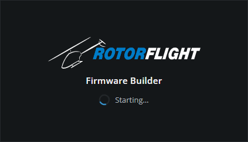

## Contents

1. [Why build custom firmware?](#1-why-build-custom-firmware)
2. [What you need](#2-what-you-need)
3. [Installing](#3-installing)
4. [Linux: serial and USB permissions (dialout and udev)](#4-linux-serial-and-usb-permissions-dialout-and-udev)
5. [First start](#5-first-start)
6. [A tour of the main window](#6-a-tour-of-the-main-window)
7. [Step by step: build and flash custom firmware](#7-step-by-step-build-and-flash-custom-firmware)
8. [Managing your builds](#8-managing-your-builds)
9. [Understanding the flash budget](#9-understanding-the-flash-budget)
10. [Removing features: firmware guards and local directories](#10-removing-features-firmware-guards-and-local-directories)
11. [Where things are stored](#11-where-things-are-stored)
12. [Troubleshooting](#12-troubleshooting)
13. [For maintainers: updating the screenshots](#13-for-maintainers-updating-the-screenshots)

---

## 1. Why build custom firmware?

Rotorflight is compiled with a fixed set of features switched on, each one
controlled by a compile-time setting called a `USE_` option (`USE_GPS`,
`USE_LED_STRIP`, `USE_SERIALRX_SBUS` and so on). On smaller flight controllers
the flash memory is nearly full, which limits what new features can be added.

Most models only use a few of those features. One receiver protocol, one kind
of telemetry, perhaps no GPS or LED strip at all. Building firmware without the
unused ones frees flash (and RAM) and makes room for others.

Betaflight does this with a cloud build service. This app does the same thing
**on your own PC**: no account, no build server, and the result is a firmware
file you can keep, name and flash again later.

---

## 2. What you need

- **A computer** running Windows 10/11 (64-bit) or 64-bit Linux.
- **An internet connection** the first time you load a firmware version, to
  download its source code and the ARM compiler (about 180 MB). After that,
  that version also works offline.
- **About 2 GB of free disk space** per firmware version (source, compiler and
  build files).
- **A USB data cable** for your flight controller, to detect and flash it.
- **The Rotorflight Configurator** (optional), to back up and restore your
  settings around a flash.

> **Safety:** always remove the rotor blades (or disconnect the motors) before
> connecting a flight controller to a computer, and never unplug it while it is
> being flashed.

---

## 3. Installing

### Windows

There are two versions; use either.

| File | What it is |
|---|---|
| `Rotorflight Firmware Builder Setup <version>.exe` | **Installer** (recommended). Installs for your user, adds a Start menu entry, and starts in a few seconds. |
| `Rotorflight Firmware Builder-<version>-portable.exe` | **Portable**. Nothing to install: it unpacks itself each time it starts, so it takes longer to open (a "Unpacking…" picture shows meanwhile). |

The app is not yet code-signed, so Windows SmartScreen may warn the first time.
Choose **More info → Run anyway**. Antivirus software may also scan a new
version for a while on its first start; later starts are much quicker.

Only one copy runs at a time: starting it again while it is open (or still
starting) brings the existing window to the front.

### Linux

| File | What it is |
|---|---|
| `rotorflight-firmware-builder-<version>-x86_64.AppImage` | A single file that runs on most distributions. |
| `rotorflight-firmware-builder-<version>-x64.tar.gz` | A folder to unpack anywhere, with the `rotorflight-firmware-builder` program inside. |

**AppImage:** make it executable, then run it:

```sh
chmod +x rotorflight-firmware-builder-*-x86_64.AppImage
./rotorflight-firmware-builder-*-x86_64.AppImage
```

AppImages need FUSE 2. If it reports that FUSE is missing, install it
(`sudo apt install libfuse2t64` on Ubuntu 24.04 and later, `libfuse2` on older
releases), or start it with `--appimage-extract-and-run`.

**Build tools:** the firmware build needs `make`, `git`, `tar` and `bzip2`. If
any is missing the app lists it with the command to install it, for example:

```sh
sudo apt install make git tar bzip2      # Debian, Ubuntu, Mint
sudo dnf install make git tar bzip2      # Fedora
```

**Sandbox:** Ubuntu 24.04 and later restrict a kernel feature that the app's
built-in security sandbox uses. If the app closes straight away with a message
about the sandbox, start it with `--no-sandbox`. With the `.tar.gz` you can
instead give the sandbox helper the rights it needs, once:

```sh
cd rotorflight-firmware-builder-*-x64
sudo chown root chrome-sandbox && sudo chmod 4755 chrome-sandbox
```

Before you can detect or flash a board on Linux, also do the one-off
permission setup in the next section.

---

## 4. Linux: serial and USB permissions (dialout and udev)

On Windows the flight controller just works once its drivers are installed. On
Linux, access to hardware is controlled by **file permissions**, and a normal
user cannot use the flight controller until they are given access. The app
talks to the board in two different ways, and each needs its own permission.

| What the app does | How it talks to the board | Permission needed |
|---|---|---|
| **Detect board**, and rebooting the board into its bootloader before a flash | The board's **serial port** (`/dev/ttyACM0`), while it runs Rotorflight | Membership of the **`dialout`** group |
| **Flashing** | The STM32 **DFU bootloader** (USB device `0483:df11`), which the board switches to for flashing | A **udev rule** for that device |

The Rotorflight Configurator needs exactly the same setup, so if it already
connects and flashes on this computer, you are done.

### What is a group?

Linux gives every device file an owner and a **group**, and lets members of
that group use it. You can see this for a connected flight controller:

```sh
ls -l /dev/ttyACM0
crw-rw---- 1 root dialout 166, 0 Oct  5 14:02 /dev/ttyACM0
```

Here the serial port belongs to the group `dialout`, and only `root` and members
of `dialout` may read and write it (`rw-rw----`). To list the groups you are in:

```sh
groups
```

### The dialout group (serial port: Detect board)

Add yourself to `dialout`:

```sh
sudo usermod -aG dialout $USER
```

Group changes only take effect at your next login, so **log out and back in**
(or restart). Then check that `dialout` appears in the output of `groups`.

- On Arch Linux and Manjaro the group is called **`uucp`** instead:
  `sudo usermod -aG uucp $USER`. Whatever its name, the group shown by
  `ls -l /dev/ttyACM0` is the one to join.
- On Ubuntu, the `ModemManager` service sometimes grabs new serial devices for a
  few seconds after they are plugged in. If Detect fails right after plugging in,
  wait a moment and try again, or remove it with `sudo apt remove modemmanager`
  if you do not use a mobile modem.

Without this permission, **Detect board** fails with an "access" or "open"
error, and the app reminds you to join the group.

### The udev rule (DFU bootloader: flashing)

When the app flashes, the board restarts as a different USB device: the STM32
DFU bootloader. That device is not a serial port and is not covered by
`dialout`. On most distributions only `root` may use it, so the app cannot find
or open it.

**udev** is the part of Linux that sets up device files as hardware is plugged
in. A **udev rule** is a one-line instruction for it: "when this device appears,
give this group access". This rule gives the `plugdev` group read and write
access to the STM32 DFU bootloader (USB ID `0483:df11`):

```sh
echo 'SUBSYSTEM=="usb", ATTRS{idVendor}=="0483", ATTRS{idProduct}=="df11", MODE="0664", GROUP="plugdev"' \
  | sudo tee /etc/udev/rules.d/45-stdfu-permissions.rules
sudo udevadm control --reload-rules
sudo udevadm trigger
```

Then make sure you are in the `plugdev` group (most desktop installs of Debian
and Ubuntu already add you):

```sh
sudo usermod -aG plugdev $USER       # then log out and back in
```

**Distributions without a `plugdev` group** (Fedora, Arch and others) can use
this rule instead. It gives access to whoever is logged in at the computer, so
no group is needed:

```sh
echo 'SUBSYSTEM=="usb", ATTRS{idVendor}=="0483", ATTRS{idProduct}=="df11", TAG+="uaccess"' \
  | sudo tee /etc/udev/rules.d/70-stdfu-permissions.rules
sudo udevadm control --reload-rules
sudo udevadm trigger
```

Unplug and reconnect the board after adding a rule. To check it worked, put
the board into DFU mode (hold its BOOT button while plugging it in) and run:

```sh
lsusb -d 0483:df11                         # should list "STM Device in DFU Mode"
ls -l /dev/bus/usb/$(lsusb -d 0483:df11 | awk '{print $2"/"substr($4,1,3)}')
```

The second line should show your group (`plugdev`), or a `+` after the
permissions for the `uaccess` rule.

Without this rule, a flash stops after "Waiting for the DFU device", or fails
with an access error, and the app points you here.

---

## 5. First start

A small splash screen shows while the app starts. The main window then opens:

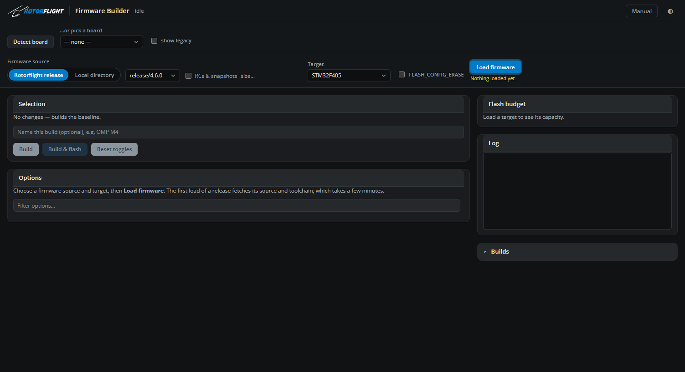

### Windows: loading the build environment

Building Rotorflight on Windows needs two free tools that are not part of
Windows: **Git for Windows** (whose Unix tools run the firmware's build scripts)
and **GNU make**. If either is missing, the app offers to install them:

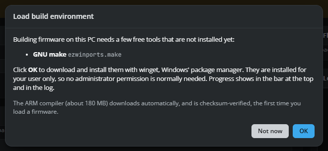

Click **OK** and the app installs them with **winget**, Windows' own package
manager. They are installed for your user only, so no administrator permission
is normally needed. (If Git cannot be installed that way, the app falls back to
a normal install: Windows then asks for permission, and that prompt may only
show as a flashing shield icon in the taskbar.) Progress shows in the bar at the
top and in the log; each install gives up after 15 minutes rather than waiting
forever. Click **Not now** to skip; a notice at the top of the window offers it
again.

The ARM compiler itself downloads automatically the first time you load a
firmware version, and is checked against a known checksum before it is used.
Nothing else needs installing.

On Linux, missing tools are listed in the same notice with the command to
install them (see [Installing](#linux)).

---

## 6. A tour of the main window

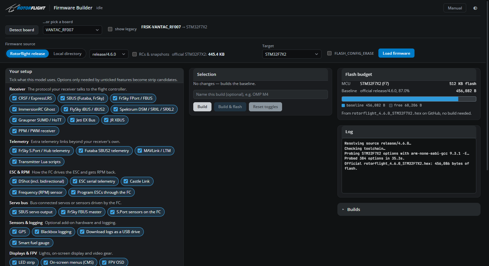

| Area | What it is for |
|---|---|
| **Header** (top) | Choose the board, the firmware source and the target, then **Load firmware**. The app's version (e.g. `v1.1.0`) is shown next to its name; quote it when reporting a problem. At the top right, **Manual** opens this manual and ◐ switches between dark and light themes. |
| **Your setup** (left) | Tick the features your model uses. Options only needed by unticked features are switched off. |
| **Selection** (middle) | The effective change from stock firmware, a name for the build, and the **Build** and **Build & flash** buttons. |
| **Options** (below) | Every `USE_` option for the target, with its state and a switch. |
| **Flash budget** (right) | How full the flash is: stock firmware, an estimate for your selection, and the measured size once built. |
| **Log** (right) | Progress messages and compiler output. Click it to show 20 lines instead of 10. |
| **Builds** (right) | Every firmware you have built, with download, flash, rename and delete. Click the heading to open or close it. |

The app remembers your choices between starts: the theme, the options filter,
Your setup and the switches for each firmware version and target.

### This manual, inside the app

Click **Manual** in the title bar to read this manual without leaving the app.
It comes with the app, so it works offline and always matches your version.
The contents and the links between sections jump to the right place; close it
with **✕** or **Esc**.

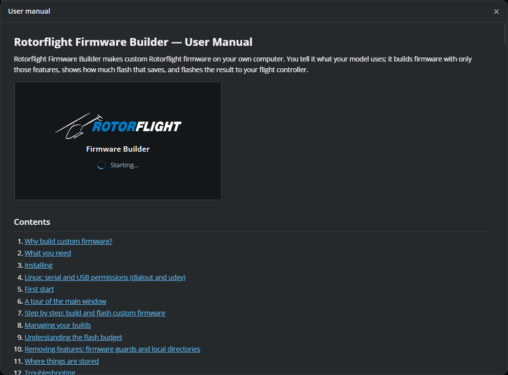

---

## 7. Step by step: build and flash custom firmware

### Step 1 — Identify your board

Plug in the flight controller (blades off!) and click **Detect board**. The app
asks which port to use:

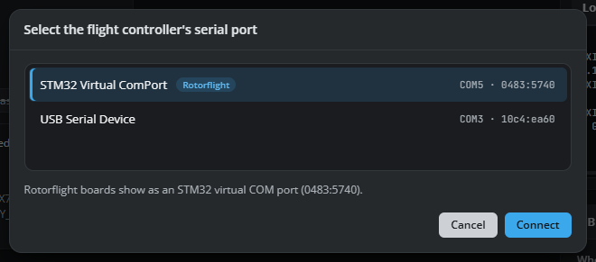

The Rotorflight board is marked and selected for you: click **Connect**. The
app reads the board's name and MCU over USB, exactly as the Configurator's
Detect does, and selects the matching **target** (the MCU type the firmware is
built for). Close the Configurator first: only one program can use the port at a
time.

Once a board has been allowed, the app detects it again by itself when it is
plugged in, or at the next start.

**No board to hand?** Pick it from **…or pick a board** instead. The list is the
Configurator's own (from `rotorflight-targets`); tick **show legacy** for older
boards. Either way, the header shows the board and its target:

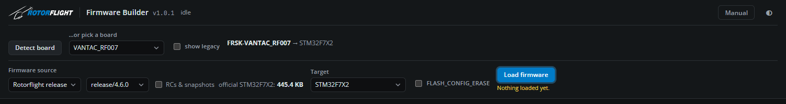

### Step 2 — Choose the firmware source

Choose where the firmware comes from in the **Firmware source** dropdown; the
controls for that choice appear next to it.

- **Rotorflight release** (the usual choice): pick a version from the list.
  Tick **RCs & snapshots** to include test versions. The official size of that
  release for your target is shown next to it (here `445.4 KB`).
- **Online repository**: build someone's fork, or a branch with work in
  progress, straight from the internet. Type the repository as `owner/repo`
  for GitHub (for example `pkaig/rotorflight-firmware`), or paste the `https://`
  address of any public git repository, then click **Find branches** (or press
  **Enter**). Pick a branch or tag from the list: the default branch is marked,
  and release tags come first. **Load firmware** then downloads that branch (each
  repository is kept separately, so it is quick next time) and it works just like
  a release. Recent repositories are offered as you type. Only public
  repositories can be used. Because a fork's own tags are not the official
  builds, the flash budget starts from the nearest official release until you
  build the baseline.
- **Local directory**: build a copy of the firmware source on your disk, for
  example your own clone with changes. See
  [section 10](#10-removing-features-firmware-guards-and-local-directories).

**FLASH_CONFIG_ERASE** erases the flight controller's saved settings the first
time the new firmware starts, as the official release files do. Leave it
unticked to keep your settings (recommended); tick it for a guaranteed clean
start.

### Step 3 — Load the firmware

Click **Load firmware**. A banner shows each step and the elapsed time:

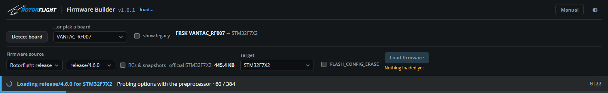

The first load of a version downloads its source and the compiler, which takes
a few minutes. The app then checks every option for your target by running the
firmware's own preprocessor, so it knows exactly which options can be switched
on or off. Later loads of the same version take about half a minute.

If you change the source, the target or FLASH_CONFIG_ERASE afterwards, the
panels below grey out and **Load firmware** is highlighted until you load again.

### Step 4 — Tell it about your model: Your setup

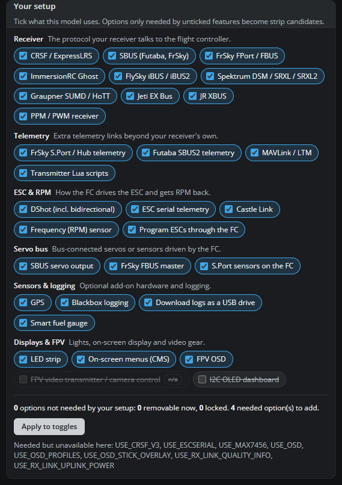

**Your setup** lists features by group: receiver protocol, telemetry, ESC and
RPM, servo bus, sensors and logging, displays and FPV. Everything the stock
firmware includes starts ticked.

**Untick what your model does not use.** For a FrSky receiver with no GPS, for
example, untick GPS and every other receiver protocol. Options that only those
features need are marked *not needed* in the options list, and switched off
where the firmware allows it. Ticking a feature again switches its options back
on. Features shown as *n/a* do not exist for this target at all.

Below the feature groups, a summary says how many options your setup does not
need, how many can be removed now, and how many are locked. Locked ones need a
change in the firmware first, explained in
[section 10](#10-removing-features-firmware-guards-and-local-directories).

### Step 5 — Review the options

The options list has three filters:

- **Changes** (the default): only what differs from the stock firmware,
  including knock-on effects.
- **Baseline**: everything the stock firmware contains.
- **All**: every option the firmware source knows about.

Type in **Filter options…** to search by name or description.

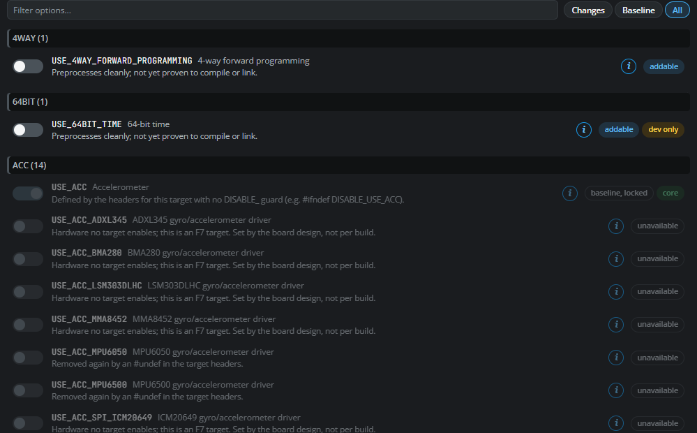

Each row has a switch, the option's name and description, and badges:

| Badge | Meaning |
|---|---|
| **removable** | In the stock firmware, and the firmware lets you remove it. The switch works. |
| **baseline, locked** | In the stock firmware, but the firmware has no way to remove it (yet). |
| **addable** | Not in the stock firmware, but can be added. The switch works. |
| **follows X** | Goes (or comes) automatically with option X. It needs no switch of its own. |
| **unavailable** | Cannot be used on this target (it clashes with the target's own settings, or belongs to another MCU). |
| **needed / not needed** | What Your setup says about it. |
| **core / platform / dev only** | Essential, chosen by the MCU, or for developers only. |

Click the **i** button on any option for its details card:

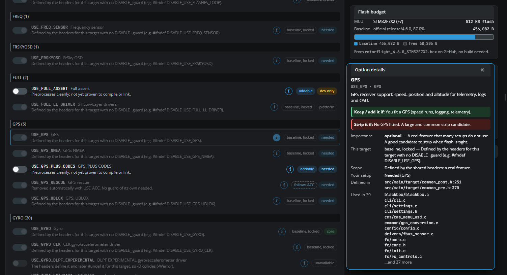

The card explains what the option is, when to keep it and when to strip it, how
important it is, why it is (or is not) changeable on this target, and where it
is defined and used in the source. If you have built that option on its own,
its measured size change is shown too. Close the card with **✕**, **Esc**, the
same **i** again, or by clicking elsewhere.

### Step 6 — Check your selection

Switching an option on or off (directly, or through Your setup) updates the
**Selection** panel. The app runs the firmware's preprocessor over the whole
selection and shows the **effective change**: options added in blue (`+`),
removed in red (`−`), and knock-on effects in italics.

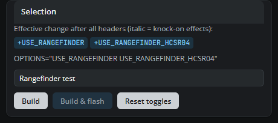

In this example, adding the HC-SR04 rangefinder also adds the general
rangefinder support it depends on. The `OPTIONS=` line is exactly what the build
passes to the firmware. With the **Changes** filter, the options list shows the
same two options:

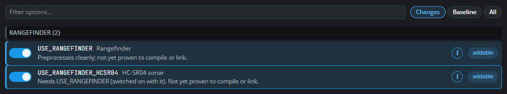

Optionally **name the build**, for example `Rangefinder test` or `OMP M4`, so you
can tell your builds apart later. **Reset toggles** clears the selection.

### Step 7 — Build

Click **Build**. The banner shows compile progress; a build takes one to three
minutes depending on your computer (the first one after changing options
compiles everything).

Before anything is built, the **flash budget** shows the stock firmware size
from the official release file:

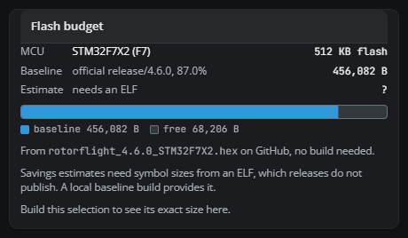

After building, it shows the measured size of your build against the stock
baseline, the official release, the firmware area and RAM:

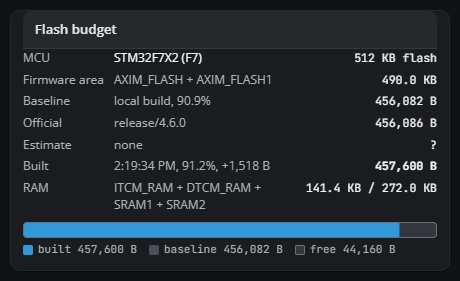

Here the rangefinder build is 457,600 bytes: 1,518 bytes more than stock, using
91.2% of the 490 KB firmware area. **Build the unchanged baseline once** per
firmware version (no options changed, or the **Build baseline** button in the
budget): it gives exact sizes, RAM use and savings estimates for later
selections.

The log shows the compiler's own memory report at the end of each build:

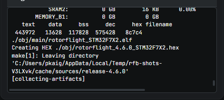

Click the log to show 20 lines (and click again for 10):

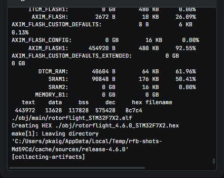

### Step 8 — Flash

**Build & flash** builds and then flashes in one go. To flash an existing build,
click **flash** next to it under **Builds**. Flashing is available once the
board has been detected (or is already in DFU mode), and needs the board chosen
in the header, because the app adds that board's configuration to the
firmware, exactly as the Configurator does.

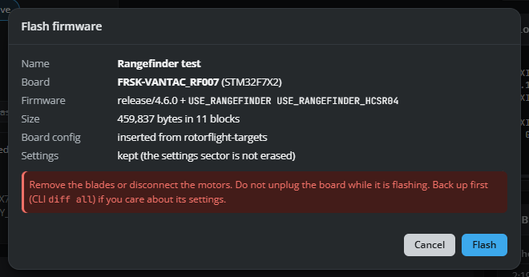

Check the dialog:

- **Name**, **Board** and **Firmware**: what is about to be flashed, and to what.
- **Board config**: *inserted from rotorflight-targets*. The firmware gets your
  board's pin and hardware configuration, as with the Configurator.
- **Settings**: *kept*, unless the build used FLASH_CONFIG_ERASE.

Click **Flash**. The app:

1. asks the board, over its serial port, to restart into its USB bootloader
   (DFU mode);
2. erases only the flash sectors the new firmware uses, so your settings
   sector is left alone;
3. writes the firmware;
4. reads everything back and compares it byte for byte;
5. restarts the board with the new firmware.

A progress bar and a step list show each stage. The app refuses to flash a
board whose MCU does not match the firmware's target.

If the board does not appear in DFU mode, the dialog explains what to try:
usually putting it into DFU by hand (hold the **BOOT** button while plugging it
in) and pressing **Try again**, or **Select DFU device…** if the app has not been
allowed to use it yet. On Windows the DFU device needs the **WinUSB** driver (use
ImpulseRC Driver Fixer or Zadig, as for the Configurator); on Linux, the udev rule
in [section 4](#4-linux-serial-and-usb-permissions-dialout-and-udev).

After flashing, connect with the Configurator and check your settings. If you
built with FLASH_CONFIG_ERASE, restore your backup (`diff all`).

**Flashing with the Configurator instead:** click **.hex** next to a build to
save the firmware file. In the Configurator's **Firmware Flasher**, choose your
board, then **Load Firmware [Local]** with that file. The Configurator adds the
board configuration itself.

---

## 8. Managing your builds

Open **Builds** in the right-hand column:

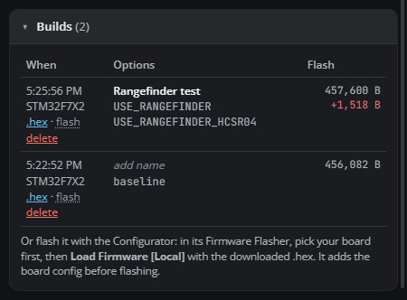

Each build shows when it was made, its target, its name and options, its flash
size and its size change against the baseline build (red: bigger; green:
smaller).

| Action | How |
|---|---|
| **Rename** | Click the name (or *add name*), type, then **Enter** to save or **Esc** to cancel. |
| **Download** | **.hex** saves the firmware file, named after the build. |
| **Flash** | **flash** opens the Flash firmware dialog for that build. |
| **Delete** | **delete** removes the build and its files, after confirming. Deleting a baseline build also removes the measurements that savings estimates rely on, until you build the baseline again. |

Builds are kept between starts.

---

## 9. Understanding the flash budget

The flash budget compares three sizes:

- **Baseline**: the stock firmware for this target. For an official release it
  comes straight from the release file on GitHub, so no build is needed. Once
  you build the baseline yourself, that measurement is used instead.
- **Estimate**: what your current selection should save, worked out from the
  baseline build's symbol table. It only counts code that sits directly inside
  each removed feature's blocks, so real savings are usually **larger** than the
  estimate. Added options are not estimated. Estimates need one local baseline
  build.
- **Built**: the exact size of a build of your current selection, once it exists.

The bar shows the build (or estimate) in front of the baseline, and the free
space that is left. It turns red if the firmware would not fit.

RAM is shown once a local baseline has been built. On some targets (F405 in
particular) RAM is the tighter limit.

---

## 10. Removing features: firmware guards and local directories

### Why most stock options are locked

The compiler can be told to **add** an option, but not to remove one that the
firmware's own files switch on. To make a stock feature removable, the
firmware needs a small **guard** around it: a flag that switches it off. Stock
Rotorflight 4.6 has no such guards, so with an official release almost every
stock option is *baseline, locked*. The app can still add options, as in the
rangefinder example.

### Guards

A guard in the firmware headers looks like either of these. Any flag name
starting `DISABLE_` works:

```c
#ifndef DISABLE_USE_LED_STRIP        // around the feature's #define
#define USE_LED_STRIP
#endif

#if defined(DISABLE_GPS)             // or an #undef after the defines
#undef USE_GPS
#endif
```

An **opt-in** works the other way round. This keeps a feature out unless its
`ENABLE_` flag is given, which makes it *addable*:

```c
#if !defined(ENABLE_CMS)
#undef USE_CMS
#endif
```

Features that depend on a removed one go with it automatically (*follows*), so
a guard is only needed on the main option. Your setup's summary lists the
guards that would make your unneeded options removable.

### Building a local directory

To build firmware source with guards (your own clone, or a branch with
changes), choose **Local directory** as the source and click **Open
directory…**:

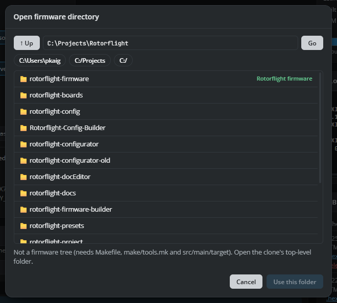

Folders that contain Rotorflight firmware are marked. Select the top-level
folder of the clone and click **Use this folder**. The app builds the folder
exactly as it is on disk, including uncommitted changes, without checking out
anything. Edits you make later are picked up by every build. After adding or
changing guards, click **Load firmware** again so the options are checked anew.

### Example: a FrSky model without GPS

With a firmware clone that has guards for GPS and the receiver protocols,
unticking GPS and the unused receivers in Your setup:

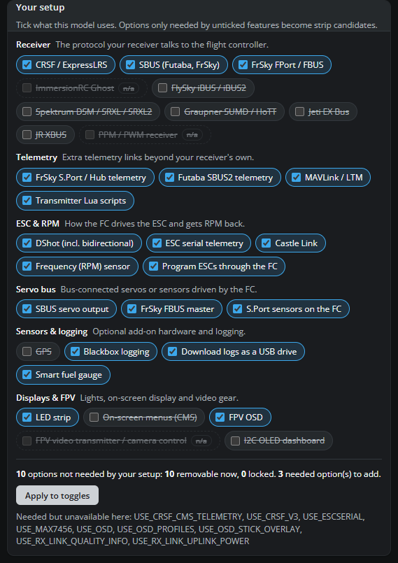

switches off every option that only those features need. The **Changes**
filter shows them, with the options that follow automatically:

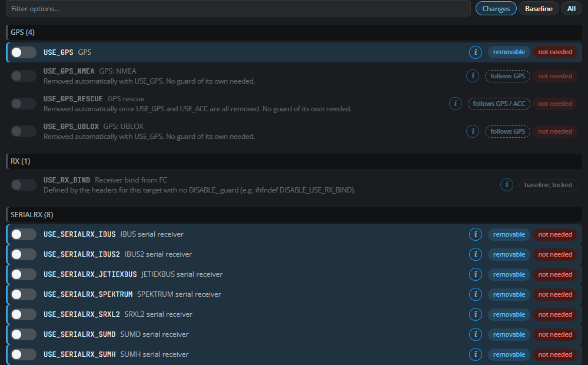

The selection shows the full effect, including knock-on removals in italics,
and the guard flags the build passes:

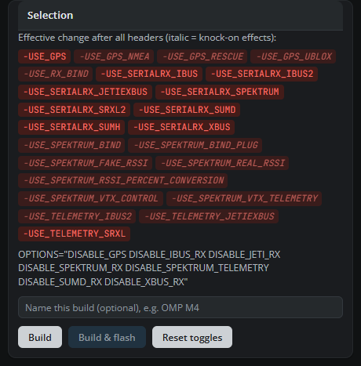

For a local directory the budget starts from the nearest release as an
approximation. Click **Build baseline** for exact sizes and estimates:

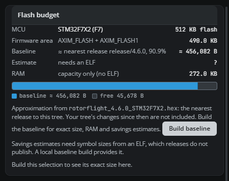

As an example of the gains, removing GPS alone saved 26.4 KB of flash on an
F405 target.

---

## 11. Where things are stored

| What | Windows | Linux |
|---|---|---|
| Your builds (`.hex`, `.bin`, `.elf`) | `Documents\Rotorflight Firmware Builder` | `~/Documents/Rotorflight Firmware Builder` |
| Firmware sources, compiler, build list, measurements | `%LOCALAPPDATA%\rotorflight-firmware-builder` | `~/.cache/rotorflight-firmware-builder` |
| Saved choices (theme, filter, Your setup, switches) | `%APPDATA%\Rotorflight Firmware Builder` | `~/.config/Rotorflight Firmware Builder` |

**File → Open builds folder** opens the first one. Deleting the second folder
frees disk space; the next load downloads again. Deleting the third resets the
app's saved choices.

---

## 12. Troubleshooting

| Problem | What to do |
|---|---|
| **Detect board fails** with "open", "access" or "in use" | Close the Configurator and anything else using the port. On Linux, join the `dialout` group ([section 4](#the-dialout-group-serial-port-detect-board)). |
| **Detect says no reply** | The board must be running Rotorflight (not in DFU mode). Wait a few seconds after plugging in, then try again, or pick the board from the list. |
| **Flash or Build & flash is greyed out** | Detect the board first, or put it in DFU mode (hold BOOT while plugging in). |
| **Flash stops at "Waiting for the DFU device"** | Windows: install the WinUSB driver for "STM32 BOOTLOADER" (ImpulseRC Driver Fixer or Zadig). Linux: add the udev rule ([section 4](#the-udev-rule-dfu-bootloader-flashing)). Then **Try again**, or **Select DFU device…**. |
| **"Board config not inserted" / Flash disabled in the dialog** | Choose the board in the header. Firmware without a board-config area must be flashed with the Configurator. |
| **The connected board is a different MCU** | The app refuses to flash. Load and build the firmware for the board's own target. |
| **Online repository: "was not found, or is private"** | Check the spelling (`owner/repo`, or the full `https://` address). Only public repositories can be used. |
| **The first load takes a long time** | It downloads the firmware source and the 180 MB compiler. Later loads are quick. |
| **"Firmware builds need a few tools…"** | Windows: click **Load build environment…**. Linux: install the listed packages. Then restart the app. |
| **A build fails** | Read the last lines of the log. Changed options can fail to compile on some targets; switch back the last option you changed. |
| **The app is slow to start** | Use the installer rather than the portable version. The first start of a new version can also be slowed by antivirus scanning. |
| **Linux: the app closes at once, mentioning the sandbox** | Start it with `--no-sandbox`, or set up `chrome-sandbox` as in [Installing](#linux). |
| **Linux: the AppImage says FUSE is missing** | Install `libfuse2t64` (or `libfuse2`), or run it with `--appimage-extract-and-run`. |

---

## 13. For maintainers: updating the screenshots

The pictures in this manual are taken from the real app, running hidden (Electron's
offscreen, headless rendering), by `docs/make-screenshots.mjs`:

```sh
npm run build
npx electron docs/make-screenshots.mjs C:\path\to\rotorflight-firmware
```

It uses a scratch cache, profile and output folder, so the pictures never show
your own builds or settings. It reuses the release downloads already in your
cache, runs two builds of `release/4.6.0` (STM32F7X2), and loads the given
firmware clone (without building it) for the pictures in section 10. Run it
from VS Code's terminal with `ELECTRON_RUN_AS_NODE` cleared.
